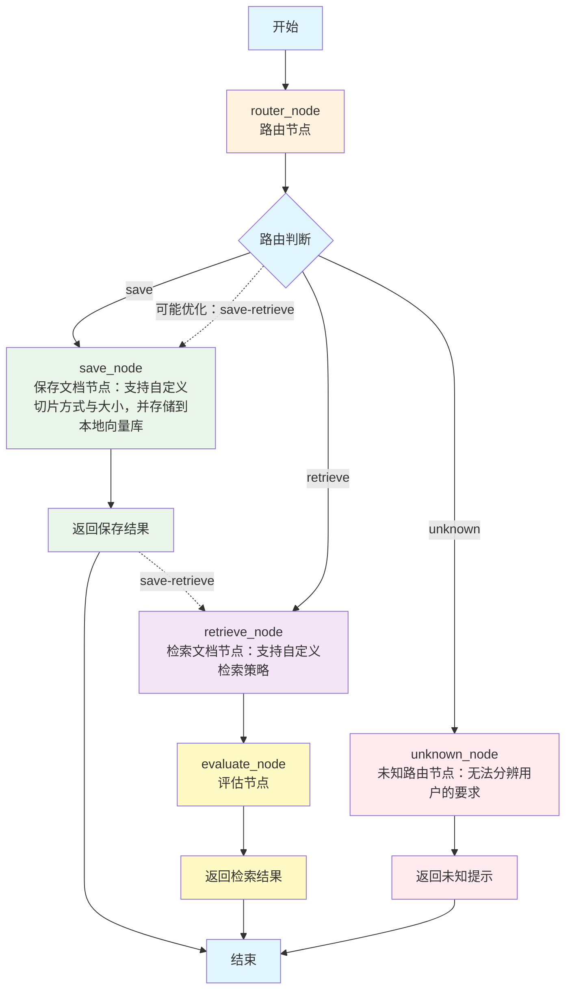

# RAG-prototype 复盘


## 项目架构

```
RAG_prototype/
├── main.py              # 主程序入口，定义 LangGraph 工作流
├── saver.py             # 文档保存和向量化处理
├── retriever.py         # 文档检索逻辑
├── evaluator.py         # 答案质量评估
├── cache_manager.py     # 缓存管理系统
├── gradio_app.py        # Gradio Web 界面
├── pyproject.toml       # 项目配置和依赖
├── requirements.txt     # Python 依赖列表
└── saved_files/         # 数据存储目录
    ├── faiss_index/     # FAISS 向量索引
    ├── bm25.pkl         # BM25 检索器
    ├── split_docs.pkl   # 分割后的文档
    └── doc_info.json    # 文档信息

```

## 环境配置
- python-version: 3.12
- uv: 0.1.23
- .env:(见.envexample)
  1. DASH_MODEL_NAME, DASHSCOPE_API_KEY, DASHSCOPE_BASE_URL, DASHSCOPE_EMBEDDING_MODEL: 
     - 配置 DashScope 模型名称、API 密钥、基础 URL 以及嵌入模型名称。
     - 默认使用qwen-turbo与text-embedding-v3作为项目中引用的llm与向量数据库的嵌入模型，如果需要更换其他运营商模型或本地模型，请在cache_manager.py中修init中的对应变量类型、get_llm() 与get_embedding()。
  2. URI = ./saved_files
     - 配置文档存储路径，默认使用./saved_files。
  3. RERANKER_NAME_OR_PATH=BAAI/bge-reranker-large
     - 配置线上重排序模型名称或本地模型路径，默认使用BAAI/bge-reranker-large, 使用reranker包调用模型进行重排序。
     - 默认为cross_encoder模型，如果使用的重排序模型不是cross_encoder,请根据https://github.com/AnswerDotAI/rerankers 修改 cache_manager中的get_reranker方法。
  4. 注意：需要在项目根目录下创建.env文件，根据.envexample配置环境变量，存储在.env中。

## 项目实现与复盘
### 1. 工作流构建（main.py）

基于 LangGraph 构建的状态图，包含节点如下：


- save: 处理编辑数据库（包括上传文件与更新数据库中已有文件）
- retrieve：
- 目前的架构只能支持用户在每一次对话中单独处理存储或者检索，不能在一次对话中同时处理存储和检索。
- 可能的优化：在路由判断中增加save-retrieve判断，当同时处理存储和检索时，先进行文档存储，再进行检索评估。

### 2. 文档保存和向量化处理（save_node）
- 功能：将用户上传的文档进行切片处理，并将切片后的文档向量化后存储到本地向量库中。
- 先由llm识别用户对切片大小和方式的要求（切片方式包含语义切片（default）、固定大小切片、递归切片与Markdown结构化切片）与上传文档所使用的语言（中文或英语），跟文档一起传递给saver.py中的save_vectorstore()函数。
- 核心功能由saver.py中的save_vectorstore()实现：
  - 文档加载与预处理，根据文档使用语言选择对应分割字符串
  - 检测文档是否已存在，存在则进行增量更新，不存在则进行数据库重建
  - 根据用户需求选择切片策略
  - 文档向量化处理
  - FAISS向量数据库增量更新或重建
  - bm25数据库重建
- 切片策略选择：
  1. 语义切片：基于文档的语义信息进行切片，每个切片的长度和内容都相对独立，适用于内容转折较为明确的文档。
     - 缺点：不便于控制切片长度，需要调用模型对每一句话进行相似度比对，时间成本较高，且语义转折较小时可能出现整个文档变成一个切片的情况，也容易出现语义分割不准。
  2. 固定大小切片：将文档按照固定长度进行切片，每个切片的长度相同，适合严格限制tokens的情况。
     - 缺点：切片长度固定，可能会在句子中间截断，且只能定义一个分隔符（本次使用默认\n\n）
  3. 递归切片：根据文档的结构进行递归切片，例如根据标题、列表等进行切片，适用于结构较为简单的情况。
     - 缺点：递归切片可能会在文档结构复杂的情况下，导致切片结果不连续，且切片长度可能会因为文档结构的不同而变化。也容易将语义切断，导致切片结果不连续。
  4. Markdown结构化切片：根据Markdown文档的结构进行切片，例如根据标题、列表等进行切片。
     - 缺点：按照md结构切片，不同的文档可能有不同的结构，且完全按照结构切片也不易于控制大小。
     - 对于过大切片，本次采用递归切片再次切分，便于控制长度。
  - 可能的优化：
    - 以上除结构化切片以外的三种切片，除了各自的问题外，都存在语义缺失的可能问题：
    - 例如：原文档为（以测试使用的部分医学文档内容为例）
      - 新生儿科  
      - 一、实验室检查与诊断评估  

      1. **大便常规检查**  
      - 确认大便中白细胞计数（WBC）是否超过19个/高倍视野（HPF），提示肠道细菌感染。  
      - 结合临床表现（如腹泻、呕吐、发热）及大便培养结果，明确病原体类型（如大肠杆菌、沙门氏菌等）。  
      - 建议出生后7天内复查大便常规及培养，评估治疗效果及病情变化。  

      2. **血常规及炎症指标**  
      - 检测白细胞计数、中性粒细胞比例、C反应蛋白（CRP）及降钙素原（PCT），辅助判断感染程度及全身炎症反应。  
      - 必要时进行血培养，排除败血症可能。  
    
      切片时可能将血常规及炎症指标以上的部分切为一片，以下的部分切为一片，导致第二片丢失与新生儿科之间的联系。
      在结构化切片时，标题会被保存到metadata中，但对metadata进行匹配筛选仍然是一个问题，而在本项目中，文件不一定采用结构化切片，因而就算对metadata进行筛选，也只能筛选部分信息。
    - 可能的解决方案：
      - 先针对较为统一的大标题进行结构切片，并存储metadata列表，再对大切片进行自定义的适合的切片方式。
      - 采用父文档检索器，匹配到整段文档。
- 数据库选择：
  - 向量数据库：FAISS
  - 词频数据库：BM25
  - 优点：
    1. 都是开源的，FAISS是Facebook(Meta)开源的向量数据库，bm25本身是一个开源算法。
    2. FAISS支持多种index，如IVF、HNSW等，能够对向量存储大小和检索速度、检索准确性进行平衡，同时支持倒排索引、聚类等多种算法，支持gpu加速。
    3. bm25易于实现,考虑词频与逆文档频率，能够避免过度强调常见词FAISS，提高检索准确性。
    4. langchain 原生支持FAISS兼容。
  - 缺点：
    1. FAISS 不同的索引类型的索引速度、存储速度、适用范围、对增删的支持不同，学习成本比较高，且标准索引类型不支持增量更新。langchain的merge_from增量更新实际上是利用索引合并完成的，即对新数据新建索引，然后与旧数据的索引合并。
    2. langchain 的bm25retriever不支持数据库改动，只能重建。除此以外也不支持元数据过滤，过滤实际上是通过对文档切片进行过滤后重建bm25索引实现。
  - 可能解决方案：
    1. 换用支持增删的向量数据库,例如milvus,milvus也集成bm25，但本身不是开源向量库。
    2. 改用BM25opt之类支持增删操作的bm25搜索引擎。
    3. 元数据过滤时，考虑增加bm25返回的k值，增加检索的文档数量，再通过元数据进行筛选，可以避免重建索引，但可能影响返回的切片数量。
    3. 定期重建FAISS数据库。
     

### 3.在数据库中检索答案（retrieve_node）
- 功能：根据用户提出的问题与定义的检索方式，在数据库中检索答案并生成回答。
- 先由llm确认用户对检索方式的要求（是否有要求，要求哪一种）、是否明确规定了文件过滤范围（有则建立对应文件过滤列表）、去除这些额外部分后用户真正想提的问题是什么，一起传递给retriever.py中的retrieve()函数。
- 核心功能由retrieve()函数实现，根据要求生成假设文档，调用对应检索器进行检索和重排序，返回检索出的文档切片。
- 返回的切片再由llm（根据问题使用的语言）逐条阅读，总结概括生成回答（refine）。
- 检索方式：
  1. hyde：基于问题生成假设文档，再基于假设文档进行检索。
  2. bm25rerank：基于关键词与向量混合检索进行重排序。
  3. faissbert：基于faiss向量库进行检索。
  4. default：以上三种方式结合，如果不定义策略默认使用此方法。
- 优点：
  1. 基于关键词与向量混合检索进行重排序，能够结合关键词与向量信息，提高检索准确性。
  2. 基于faiss向量库进行检索，能够快速检索出与问题相关的文档切片。
  3. 基于假设文档进行检索，能够为概括的问题提供细节，便于搜索到可能的相关回答。
  4. 用llm辨认真实问题与文件过滤列表，能够简化操作。
- 缺点：
  1. 生成假设文档时，假设文档本身可能会对搜索结果造成误导。例如：
     - 问题：新生儿的检查项目有哪些？
     - 假设文档：新生儿的检查项目包括：血常规、尿常规、大便常规检查、血常规及炎症指标。
     - 这种情况下，假设文档可能会对搜索结果造成误导，因为假设文档中没有包含所有的检查项目。此时搜索会不止搜索到新生儿检查项目，还可能搜索到需要以上检查的其他疾病的相关文档。修改提示词无法避免这种问题，因为本身的确是对问题的细化。
  2. llm在辨认真实问题与文件过滤列表时，可能会出错，例如：
     - 问题：新生儿的检查项目有哪些？
     - 文件过滤列表：儿科疾病治疗方案汇总.md
     - 这种情况下，llm可能会错误地将问题与文件过滤列表进行匹配，导致检索结果的准确性降低。需要更仔细的对提示词进行调整以避免这种情况，但还是会有例外发生。
  3. 筛选检索方式、文件过滤、生成假设文档、重排序、最后生成回答都要调用模型，会延长生成回答的时间（每次调用模型都需要等待模型响应，由于流程也无法并行调用）。在该项目中使用default方式检索需要40s左右，加上生成评估的时间能到达一分钟以上，但本身数据库并不算大（仅有7个文档）。
  4. llm生成回答时，会有一定幻觉。
- 可能的解决方案：
  - 限制假设文档的使用范围，只在出现非常相关的文档时才使用假设文档对搜索方向进行限制。
  - 调整提示词，让llm生成回答时注意关键词与问题相关性，对答案相关性再进行一次筛选。
  - 设置额外输入框，让用户自己输入选择文件过滤。
  - 用类似langchain ensembleRetriever() 的权重计算代替cross-encoder，减少模型调用。

### 4.对检索效果与生成回答进行评估（evaluate_node）
- 功能：根据用户提出的问题、检索到的文档切片、生成的回答，评估回答的相关性、完整性、准确性。
- 由evaluator.py中的RetrievalEvaluator与GenerationEvaluator两个类实现。
- 评估指标：
  - 检索到的切片（与问题进行余弦相似度比对）：
       1. 计算检索结果与query的语义相似度：平均相似度、最大相似度。
       2. 计算覆盖度分数（基于检索结果多样性）：计算结果间余弦相似度的平均值，与1的差值越大，多样性越高，覆盖度越高。
  - 生成回答（利用llm判断）：1-5分，分数越高越满足条件。
       1. 事实一致性检查：验证答案是否忠实于来源。
       2. 回答相关性评估：验证答案与问题的相关性。
       3. 信息完整性评估：验证答案的完整性。

### 5.缓存管理（cache_manager.py）
- 功能：管理数据库与模型的缓存，避免重复加载。
- 在CacheManager类中提供缓存加载、数据库更新、缓存清除等函数。

### 6.Gradio Web 界面与应用启动（gradio_app.py）
- 功能：提供用户交互界面，接收用户问题与md文件上传，调用模型生成回答，返回回答。
- 应用启动： uv run gradio_app.py, 浏览器会自动访问 http://localhost:7860
- 应用启动时自动加载数据库的文件列表。
- 随着文件的上传更新数据库中的文件列表,上传文件只支持md文档。
- 应用关闭：Ctrl+C 关闭应用或点击右上角关闭应用按钮或直接关闭浏览器。
- 应用关闭时自动清除缓存并保存文件列表。

### 7.数据库文件（saved_files）
- 功能：存储本地数据库。
    1. faiss_index: 存储faiss向量库索引文件。
    2. bm25.pkl: 存储bm25模型文件。
    3. split_docs.pkl: 存储切片文档，便于索引的重建与更新。
    4. doc_info.json: 存储数据库中上传文档的信息（名称）。

 


